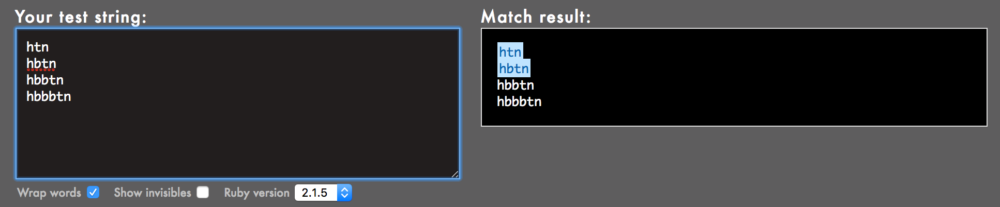

# (78) 0x06. Regular expression
Foundations > System engineering & DevOps > Scripting

---

### Project author
Sylvain Kalache

### Assignment dates
07-06-2020 to 07-07-2020

### Description
Introduction to regular expressions, first in the context of Ruby scripts.

### Note
For this project, you have to build your regular expressions using Oniguruma, a regular expression library that which is used by Ruby by default. Note that other regular expression libraries sometimes have different properties.

Because the focus of this exercise is to play with regular expressions (regex), you can use the following Ruby code example, and simply replace the regex (code in between the `//`):
```ruby
#!/usr/bin/env ruby
puts ARGV[0].scan(/127.0.0.[0-9]/).join
```

---

## Mandatory Tasks

### :white_check_mark: 0. Simply matching School
Requirements:
* The regular expression must match `School`
* Using the project instructions, create a Ruby script that accepts one argument and pass it to a regular expression matching method


File(s): [`0-simply_match_school.rb`](./0-simply_match_school.rb)

### :white_check_mark: 1. Repetition Token #0
Requirements:
* Find the regular expression that will match the above cases
* Using the project instructions, create a Ruby script that accepts one argument and pass it to a regular expression matching method


File(s): [`1-repetition_token_0.rb`](./1-repetition_token_0.rb)

### :white_check_mark: 2. Repetition Token #1
Requirements:
* Find the regular expression that will match the above cases
* Using the project instructions, create a Ruby script that accepts one argument and pass it to a regular expression matching method



File(s): [`2-repetition_token_1.rb`](./2-repetition_token_1.rb)

### :white_check_mark: 3. Repetition Token #2
Requirements:
* Find the regular expression that will match the above cases
* Using the project instructions, create a Ruby script that accepts one argument and pass it to a regular expression matching method


File(s): [`3-repetition_token_2.rb`](./3-repetition_token_2.rb)

### :white_check_mark: 4. Repetition Token #3
Requirements:
* Find the regular expression that will match the above cases
* Using the project instructions, create a Ruby script that accepts one argument and pass it to a regular expression matching method
* Your regex should not contain square brackets

File(s): [`4-repetition_token_3.rb`](./4-repetition_token_3.rb)

### :white_check_mark: 5. Not quite HBTN yet
Requirements:
* The regular expression must be exactly matching a string that starts with `h` ends with `n` and can have any single character in between
* Using the project instructions, create a Ruby script that accepts one argument and pass it to a regular expression matching method

File(s): [`5-beginning_and_end.rb`](./5-beginning_and_end.rb)

### :white_check_mark: 6. Call me maybe
Requirement:
* The regular expression must match a 10 digit phone number

File(s): [`6-phone_number.rb`](./6-phone_number.rb)

### :white_check_mark: 7. OMG WHY ARE YOU SHOUTING?
Requirement:
* The regular expression must be only matching: capital letters

File(s): [`7-OMG_WHY_ARE_YOU_SHOUTING.rb`](./7-OMG_WHY_ARE_YOU_SHOUTING.rb)

## Advanced Tasks

### :white_check_mark: 8. Textme
Write a script that parses a TextMe app text message transaction log.

Requirements:
* Your script should output: `[SENDER],[RECEIVER],[FLAGS]`
    * The sender phone number or name (including country code if present)
    * The receiver phone number or name (including country code if present)
    * The flags that were used

Example:
```bash
$ ./100-textme.rb 'Feb 1 11:00:00 ip-10-0-0-11 mdr: 2016-02-01 11:00:00 Receive SMS [SMSC:SYBASE1] [SVC:] [ACT:] [BINF:] [FID:] [from:Google] [to:+16474951758] [flags:-1:0:-1:0:-1] [msg:127:This planet has - or rather had - a problem, which was this: most of the people on it were unhappy for pretty much of the time.] [udh:0:]'
Google,+16474951758,-1:0:-1:0:-1
$
$
$ ./100-textme.rb 'Feb 1 11:00:00 ip-10-0-64-10 mdr: 2016-02-01 11:00:00 Receive SMS [SMSC:SYBASE2] [SVC:] [ACT:] [BINF:] [FID:] [from:+17272713208] [to:+19172319348] [flags:-1:0:-1:0:-1] [msg:136:Orbiting this at a distance of roughly ninety-two million miles is an utterly insignificant little blue green planet whose ape-descended] [udh:0:]'
+17272713208,+19172319348,-1:0:-1:0:-1
$
$ ./100-textme.rb 'Feb 1 11:00:00 ip-10-0-64-11 mdr: 2016-02-01 11:00:00 Sent SMS [SMSC:SYBASE1] [SVC:backendtextme] [ACT:] [BINF:] [FID:] [from:18572406905] [to:14022180266] [flags:-1:0:-1:-1:-1] [msg:136:Far out in the uncharted backwaters of the unfashionable end of the western spiral arm of the Galaxy lies a small unregarded yellow sun.] [udh:0:]'
18572406905,14022180266,-1:0:-1:-1:-1
$
$
$ ./100-textme.rb 'Feb 1 11:00:00 ip-10-0-64-11 mdr: 2016-02-01 11:00:00 Sent SMS [SMSC:SYBASE1] [SVC:backendtextme] [ACT:] [BINF:] [FID:] [from:12392190384] [to:19148265919] [flags:-1:0:-1:-1:-1] [msg:99:life forms are so amazingly primitive that they still think digital watches are a pretty neat idea.] [udh:0:]'
12392190384,19148265919,-1:0:-1:-1:-1
$
```

File(s): [`100-textme.rb`](./100-textme.rb)

### :white_check_mark: 9. Pass LinkedIn technical interview level0
One way to get started in getting a Software Engineering job at LinkedIn is to solve their regex puzzle.

Requirements:
* Solve LinkedIn regex puzzle: https://engineering.linkedin.com/puzzle
* Provide as an answer file a screenshot of the “Congratulations” screen with the date and time of completion

File(s): [`101-passed_linkedin_regex_challenge.jpg`](./101-passed_linkedin_regex_challenge.jpg)

---

## Student
* **Samuel Pomeroy** - [allelomorph](github.com/allelomorph)
