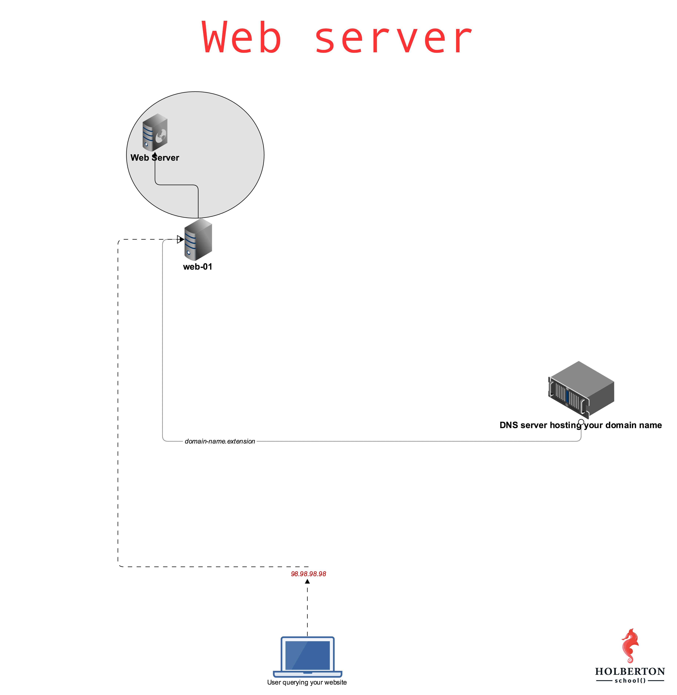

# (266) 0x0C. Web server
Foundations > System engineering & DevOps > Web stack

---

### Project author
Sylvain Kalache

### Assignment dates
08-04-2020 to 08-06-2020

### Description
Introduction to Nginx and futher exploration of processes, HTTP, and web servers. Creating scripts to automate setup of the servers which will host the [AirBnB clone](https://github.com/allelomorph/holbertonschool-higher_level_programming/#airbnb-clone) projects.

---



## Mandatory Tasks

### :white_check_mark: 0. Transfer a file to your server
Write a Bash script that transfers a file from our client to a server:

Requirements:
* Accepts 4 parameters
    * The path to the file to be transferred
    * The IP of the server we want to transfer the file to
    * The username `scp` connects with
    * The path to the SSH private key that scp uses
* Display `Usage: 0-transfer_file PATH_TO_FILE IP USERNAME PATH_TO_SSH_KEY` if less than 4 parameters passed
* `scp` must transfer the file to the user home directory `~/`
* Strict host key checking must be disabled when using `scp`

That is one way of publishing your website pages to your server.

File(s): [`0-transfer_file`](./0-transfer_file)

### :white_check_mark: 1. Install nginx web server
Read:
* [-y on apt-get command](https://askubuntu.com/questions/672892/what-does-y-mean-in-apt-get-y-install-command)

Web servers are the piece of software generating and serving HTML pages, let’s install one!

Requirements:
* Install `nginx` on your `web-01` server
* Nginx should be listening on port 80
* When querying Nginx at its root `/` with a `GET` request (requesting a page) using `curl` - it must return a page that contains the string `Hello World`
* As an answer file, write a Bash script that configures a new Ubuntu machine to respect above requirements (this script will be run on the server itself)
* You can’t use `systemctl` for restarting `nginx`

Server terminal:
```bash
root@web-01$ ./1-install_nginx_web_server > /dev/null 2>&1
root@web-01$ 
root@web-01$ curl localhost
Hello World!
root@web-01$ 
```
Local terminal:
```bash
$ curl 34.198.248.145/
Hello World!
$ curl -sI 34.198.248.145/
HTTP/1.1 200 OK
Server: nginx/1.4.6 (Ubuntu)
Date: Tue, 21 Feb 2017 23:43:22 GMT
Content-Type: text/html
Content-Length: 30
Last-Modified: Tue, 21 Feb 2017 07:21:32 GMT
Connection: keep-alive
ETag: "58abea7c-1e"
Accept-Ranges: bytes

$
```
In this example `34.198.248.145` is the IP of the `web-01` server. If you want to query the Nginx that is locally installed on your server, you can use `curl 127.0.0.1`.

If things are not going as expected, make sure to check out Nginx logs, they can be found in `/var/log/`.

File(s): [`1-install_nginx_web_server`](./1-install_nginx_web_server)

### :white_check_mark: 2. Setup a domain name
[.TECH Domains](https://get.tech/) is one of the top domain providers. They are known for the stability and quality of their DNS hosting solution. We partnered with .TECH Domains so that you can learn about DNS.

Provide the domain name in your answer file.

Requirement:
* provide the domain name only (example: `foobar.tech`), no subdomain (example: `www.foobar.tech`)
* configure your DNS records with an A entry so that your root domain points to your `web-01` IP address. **Warning: the propagation of your records can take time (~1-2 hours)**
* go to your profile and enter your domain in the `Project website url` field

Example:
```bash
$ cat 2-setup_a_domain_name
myschool.tech
$
$ dig myschool.tech

; <<>> DiG 9.10.6 <<>> myschool.tech
;; global options: +cmd
;; Got answer:
;; ->>HEADER<<- opcode: QUERY, status: NOERROR, id: 26785
;; flags: qr rd ra; QUERY: 1, ANSWER: 1, AUTHORITY: 0, ADDITIONAL: 1

;; OPT PSEUDOSECTION:
; EDNS: version: 0, flags:; udp: 512
;; QUESTION SECTION:
;myschool.tech.     IN  A

;; ANSWER SECTION:
myschool.tech.  7199    IN  A   184.72.193.201

;; Query time: 65 msec
;; SERVER: 8.8.8.8#53(8.8.8.8)
;; WHEN: Fri Aug 02 09:44:36 PDT 2019
;; MSG SIZE  rcvd: 65

$ 
```
When your domain name is setup, please verify the Registrar here: https://whois.whoisxmlapi.com/ and you must see in the JSON response: `"registrarName": "Dotserve Inc"`

File(s): [`2-setup_a_domain_name`](./2-setup_a_domain_name)

### :white_check_mark: 3. Redirection
Readme:
* [Replace a line with multiple lines with sed](https://stackoverflow.com/questions/26041088/sed-replace-line-with-multiline-variable)

Configure your Nginx server so that `/redirect_me` is redirecting to another page.

Requirements:
* The redirection must be a “301 Moved Permanently”
* You answer file should be a Bash script containing commands to automatically configure a Ubuntu machine to respect above requirements
* Using what you did with `1-install_nginx_web_server`, write `3-redirection` so that it configures a brand new Ubuntu machine to the requirements asked in this task

Example:
```bash
$ curl -sI 34.198.248.145/redirect_me/
HTTP/1.1 301 Moved Permanently
Server: nginx/1.4.6 (Ubuntu)
Date: Tue, 21 Feb 2017 21:36:04 GMT
Content-Type: text/html
Content-Length: 193
Connection: keep-alive
Location: https://www.youtube.com/watch?v=QH2-TGUlwu4

$ 
```

File(s): [`3-redirection`](./3-redirection)

### :white_check_mark: 4. Not found page 404
Configure your Nginx server to have a custom 404 page that contains the string `Ceci n'est pas une page`.

Requirements:
* The page must return an HTTP 404 error code
* The page must contain the string `Ceci n'est pas une page`
* Using what you did with `3-redirection`, write `4-not_found_page_404` so that it configures a brand new Ubuntu machine to the requirements asked in this task

Example:
```bash
$ curl -sI 34.198.248.145/xyz
HTTP/1.1 404 Not Found
Server: nginx/1.4.6 (Ubuntu)
Date: Tue, 21 Feb 2017 21:46:43 GMT
Content-Type: text/html
Content-Length: 26
Connection: keep-alive
ETag: "58acb50e-1a"

$ curl 34.198.248.145/xyzfoo
Ceci n'est pas une page

$ 
```

File(s): [`4-not_found_page_404`](./4-not_found_page_404)

## Advanced Tasks

### :white_large_square: 5. Design a beautiful 404 page
Some staff favorites:
* [Digital Ocean](https://www.digitalocean.com/community/tutorials/holbertonschool)
* [GitHub](https://github.com/holbertonschool/pagenotfound)
* [Lego](https://www.lego.com/en-us/404)
* [StickerMule](https://www.stickermule.com/404)

Get creative and design your own!

Note that if you decide to have your creative 404 page as the default one, make sure that it still contains the string `Ceci n'est pas une page` (otherwise the previous task will fail.)

Submit the URL of your 404 page in the field below.

File(s): [`5-design_a_beautiful_404_page`](./5-design_a_beautiful_404_page)

### :white_check_mark: 6. Install Nginx web server (w/ Puppet)
Time to practice configuring your server with Puppet! Just as you did before, we’d like you to install and configure an Nginx server using Puppet instead of Bash. To save time and effort, you should also include resources in your manifest to perform a 301 redirect when querying `/redirect_me`.

Requirements:
* Nginx should be listening on port 80
* When querying Nginx at its root `/` with a `GET` request (requesting a page) using `curl`, it must return a page that contains the string `Hello World`
* The redirection must be a “301 Moved Permanently”
* Your answer file should be a Puppet manifest containing commands to automatically configure an Ubuntu machine to respect above requirements

File(s): [`7-puppet_install_nginx_web_server.pp`](./7-puppet_install_nginx_web_server.pp)

---

## Student
* **Samuel Pomeroy** - [allelomorph](github.com/allelomorph)
