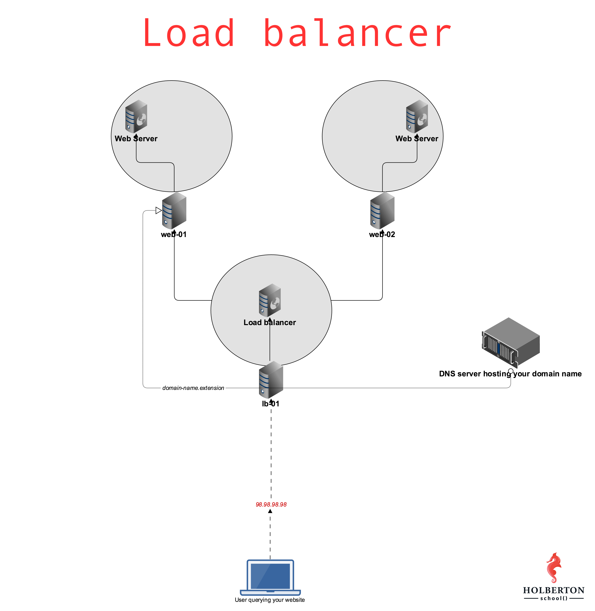

# (275) 0x0F. Load balancer
Foundations > System engineering & DevOps > Web stack

---

### Project author
Sylvain Kalache

### Assignment dates
08-14-2020 to 08-15-2020

### Description
Introduction to the use of load balancers to distribute traffic to redundant web servers.

---



## Mandatory Tasks

### :white_check_mark: 0. Double the number of webservers
In this first task you need to configure `web-02` to be identical to `web-01`. Fortunately, you built a Bash script during your web server project, and they’ll now come in handy to easily configure `web-02`. Remember, always try to automate your work!

Since we’re placing our web servers behind a load balancer for this project, we want to add a custom Nginx response header. The goal here is to be able to track which web server is answering our HTTP requests, to understand and track the way a load balancer works. More in the coming tasks.

Requirements:
* Configure Nginx so that its HTTP response contains a custom header (on `web-01` and `web-02`)
    * The name of the custom HTTP header must be `X-Served-By`
    * The value of the custom HTTP header must be the hostname of the server Nginx is running on
* Write `0-custom_http_response_header` so that it configures a brand new Ubuntu machine to the requirements asked in this task
    * [Ignore](https://github.com/koalaman/shellcheck/wiki/Ignore) [SC2154](https://github.com/koalaman/shellcheck/wiki/SC2154) for `shellcheck`

File(s): [`0-custom_http_response_header`](./0-custom_http_response_header)

### :white_check_mark: 1. Install your load balancer
Install and configure HAproxy on your `lb-01` server.

Requirements:
* Configure HAproxy with version equal or greater than 1.5 so that it send traffic to `web-01` and `web-02`
* Distribute requests using a roundrobin algorithm
* Make sure that HAproxy can be managed via an init script
* Make sure that your servers are configured with the right hostnames: `[STUDENT_ID]-web-01` and `[STUDENT_ID]-web-02`
* For your answer file, write a Bash script that configures a new Ubuntu machine to respect above requirements

Example:
```bash
$ curl -Is 54.210.47.110
HTTP/1.1 200 OK
Server: nginx/1.4.6 (Ubuntu)
Date: Mon, 27 Feb 2017 06:12:17 GMT
Content-Type: text/html
Content-Length: 30
Last-Modified: Tue, 21 Feb 2017 07:21:32 GMT
Connection: keep-alive
ETag: "58abea7c-1e"
X-Served-By: 03-web-01
Accept-Ranges: bytes

$ curl -Is 54.210.47.110
HTTP/1.1 200 OK
Server: nginx/1.4.6 (Ubuntu)
Date: Mon, 27 Feb 2017 06:12:19 GMT
Content-Type: text/html
Content-Length: 612
Last-Modified: Tue, 04 Mar 2014 11:46:45 GMT
Connection: keep-alive
ETag: "5315bd25-264"
X-Served-By: 03-web-02
Accept-Ranges: bytes

$ 
```

File(s): [`1-install_load_balancer`](./1-install_load_balancer)

## Advanced Tasks

### :white_check_mark: 2. Add a custom HTTP header with Puppet
Just as in task #0, we’d like you to automate the task of creating a custom HTTP header response, but with Puppet.
* The name of the custom HTTP header must be `X-Served-By`
* The value of the custom HTTP header must be the hostname of the server Nginx is running on
* Write `2-puppet_custom_http_response_header.pp` so that it configures a brand new Ubuntu machine to the requirements asked in this task

File(s): [`2-puppet_custom_http_response_header.pp`](./2-puppet_custom_http_response_header.pp)

---

## Student
* **Samuel Pomeroy** - [allelomorph](github.com/allelomorph)
